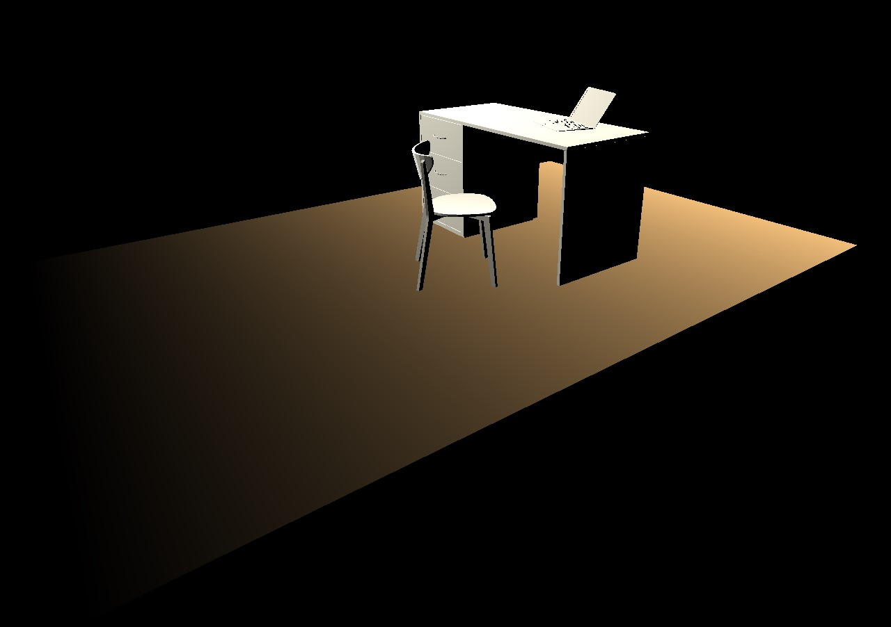

# CMPM163Labs
Repository for CMPM 163 Lab assignments
## Lab 2
Part 1 video - https://drive.google.com/open?id=1THVmpAKA8kBX_OiLDwj55unPSwM4cxLL  
Part 2  

## Lab 3
Part 2 video - https://drive.google.com/open?id=17i05UqYnq_LX3iHGPRiol5rIfp_AQY6N
- For the custom shader for the first cube (top-left) I interpolated between blue and pink using the shaders given in the lab instructions.
- For the custom shader for the second cube (bottom-left) I manipulated vertex positions to make the cube appear irregular. Thank you to cjgammon for a great tutorial on how to do this: http://blog.cjgammon.com/threejs-custom-shader-material
## Lab 4
Part 2 video - https://drive.google.com/open?id=14SnlCz3njNCZJP4UKDlMTQ20dvvKFUPQ
- Answers to 24  
a) Assuming we do not consider upsampling or downsampling, x=uw is the value of the pixel to sample from the given 8x8 texture.  
b) Similar to (a) y=vh  
c) x = 0.375 * 7 = 2, y = 0.25 * 7 = 1, at (2,1) the color is white. x and y are truncated values.  
- How each cube was created
Cube1(far-right): This cube used the three.js built in texture functionality.  
Cube2(far-left): This cube used the three.js built in texture functionality and included a normal map.  
Cube3(front-center): This cube used the three.js built in texture functionality and included a normal map.  
Cube4(rear-center): This cube used the three.js built in texture functionality and included a normal map.
Cube5(mid-top): This cube used a texture loaded with shaders.
Cube6(top): This cube was tiled on a 2x2 grid by using a texture loaded with shaders and by using the mod() function for repeats.
